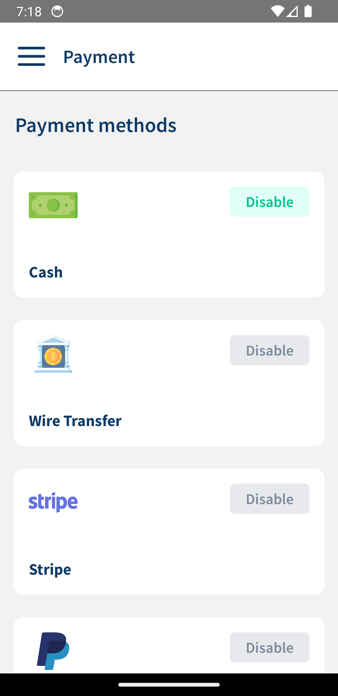
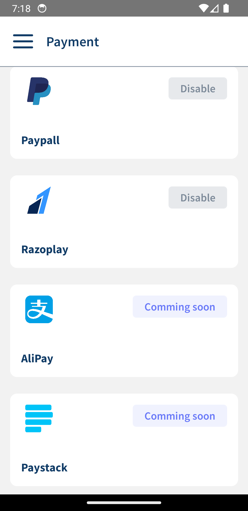

# VetrinaLive Project Readme

## Overview

Welcome to VetrinaLive, an E-Commerce solution for shop owners, built with React Native for the mobile application and JSON Server for backend simulation during development. The project is currently in demo mode, having been constructed from the ground up.

## Features

- **Effortless Setup:** You just need to sign up and follow the wizard to create online stores without technical expertise.

<p align="center">
    
    
</p>

- **Intuitive Dashboard:** The dashboard is designed to make the shopping experience a pleasure and maximaze the exposure of your products.

<p align="center">
    
    
    
    
</p>

- **Product Management:** Easily add and manage products.

<p align="center">
    
    
    
</p>

- **Order Management:** Efficient features for order handling.

<p align="center">
    
</p>

- **Payment and Subscription Methods:** Supports various transaction methods: debit cards (with Stripe), PayPal, or wire transfer and subscription models.

<p align="center">
    
    
    
</p>

## Getting Started

1. **Clone the Repository:**

   ```bash
   git clone https://github.com/NemanjaDobranic/vetrinalive.git
   ```

2. **Install Dependencies:**

   ```bash
   cd vetrinalive
   cd VetrinaLive
   npm install
   ```

3. **Setting up JSON Server:**
   As the project was built using Android emulator, the server cannott run on `localhost`. Instead, the acutal IP address needs to be used, which can be retrieved using command:

   ```cmd
   ipconfig
   ```

   Subsequently, replace every occurrence of 192.168.1.9 in the project with your specific IP address.

   Run server using command:

   ```bash
   npm run json-server
   ```

4. **Run the Application:**

   ```bash
   npm run start
   ```

   Open the Metro Bundler and run the app on an emulator or physical device.

5. **Sign Up and Follow the Wizard:**
   Open the VetrinaLive app, sign up, and follow the setup wizard to create your online shop. Testing email: `thomas@mail.com` and password: `123456`

## License

This project is licensed under the [MIT License](https://opensource.org/license/mit/). You are free to use, modify, and distribute it as per the terms of the license.
